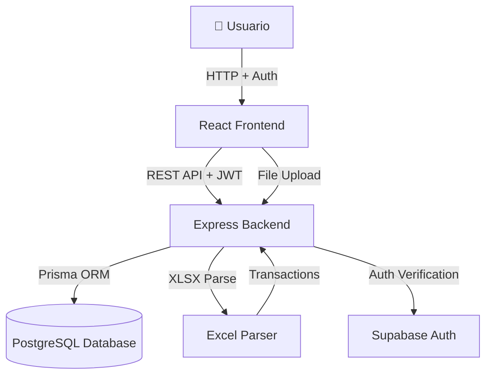

# Arquitectura del Sistema - Finanzas App

Documentación técnica de la arquitectura, decisiones de diseño y estructura del proyecto.

---

## 🏗️ System Overview



**Finanzas App** es una aplicación web full-stack diseñada con arquitectura monorepo que separa claramente la capa de presentación (frontend) de la lógica de negocio (backend).

### Flujo de Datos General

1.  **Auth**: Usuario se registra/loguea vía Supabase Auth -> Obtiene JWT.
2.  **Upload**: Usuario carga archivo Excel → Backend valida JWT y parsea → Retorna JSON.
3.  **Review**: Frontend mantiene transacciones en memoria → Usuario asigna items.
4.  **Save**: Frontend envía transacciones confirmadas con JWT → Backend guarda en BD asignando `userId`.
5.  **Query**: Frontend consulta transacciones con filtros → Backend filtra por `userId` y retorna datos.

---

## 📦 Monorepo Structure

### TurboRepo

Utiliza **TurboRepo** para gestionar el monorepo con las siguientes ventajas:

- **Build caching**: Evita rebuilds innecesarios
- **Parallel execution**: Ejecuta tareas en paralelo
- **Pipeline orchestration**: Define dependencias entre tasks

**Configuración**: `turbo.json`

```json
{
  "pipeline": {
    "build": {
      "dependsOn": ["^build"],
      "outputs": ["dist/**"]
    },
    "dev": {
      "cache": false
    }
  }
}
```

### Package Organization

```
packages/
├── frontend/        # Cliente React
│   └── src/
│       ├── components/   # UI components
│       ├── pages/        # Route pages
│       ├── hooks/        # React hooks
│       ├── stores/       # Zustand state
│       ├── lib/          # Utilities
│       ├── providers/    # Context providers (Auth)
│       └── types/        # TypeScript types
│
└── backend/         # API Express
    └── src/
        ├── controllers/  # HTTP handlers
        ├── services/     # Business logic
        ├── routes/       # API routes
        ├── middleware/   # Express middleware (Auth)
        └── utils/        # Helpers
```

### Dependencies

- **Root level**: Tooling compartido (TypeScript, TurboRepo)
- **Frontend**: React ecosystem
- **Backend**: Node.js ecosystem

---

## ⚛️ Frontend Architecture

### Tech Stack

- **React 19** - UI library
- **Vite 7** - Build tool & dev server
- **TypeScript 5.9** - Type safety
- **React Router 7** - Client-side routing
- **TanStack Query** - Server state management
- **Zustand** - Client state management
- **Tailwind CSS 4** - Styling
- **shadcn/ui** - Component library
- **Supabase Client** - Authentication

### Component Structure

Sigue principios de **Atomic Design**:

```
components/
├── ui/                # Atoms (shadcn/ui base components)
│   ├── button.tsx
│   ├── dialog.tsx
│   ├── tabs.tsx
│   └── ...
├── dashboard/         # Molecules/Organisms
│   ├── TransactionsTable.tsx
│   ├── DashboardChartsRenderer.tsx
│   └── PeriodSelector.tsx
├── items/            # Feature-specific components
│   ├── ItemForm.tsx
│   └── CategoriesList.tsx
├── skeletons/        # Loading states
│   └── DashboardSkeleton.tsx
└── ProtectedRoute.tsx # Route Guard

pages/
├── AuthPage.tsx           # Unified login/register
├── AuthCallback.tsx       # Auth redirect handler
├── DashboardPage.tsx
├── ItemsPage.tsx
└── AnalyticsPage.tsx
```

**Componentes Clave de UX/UI:**

- **`AuthPage`**: Página unificada con diseño split-layout para login/registro
- **`AuthCallback`**: Maneja redirecciones de Supabase (confirmación de email)
- **`DashboardSkeleton`**: Loading state elegante durante fetch de datos
- **`ProtectedRoute`**: Guard que redirige según estado de autenticación

### State Management

**Server State (TanStack Query):**

- Transacciones
- Items
- Categorías
- Stats/Analytics

```typescript
const { data, isLoading } = useQuery({
  queryKey: ["transactions", filters],
  queryFn: () => apiClient.getTransactions(filters),
});
```

**Client State (Zustand):**

- Filtros de período (trimestre/año)
- UI state (modals, toasts)

```typescript
const usePeriodStore = create<PeriodStore>((set) => ({
  selectedQuarter: "ALL",
  selectedYear: new Date().getFullYear(),
  setQuarter: (quarter) => set({ selectedQuarter: quarter }),
}));
```

**Global Auth State (Context):**

- Provee el usuario y sesión de Supabase a toda la app.
- Maneja auto-refresh de tokens mediante `onAuthStateChange`

### Routing

```typescript
<AuthProvider>
  <Routes>
    {/* Rutas Públicas */}
    <Route path="/auth" element={<AuthPage />} />
    <Route path="/auth/callback" element={<AuthCallback />} />

    {/* Rutas Protegidas */}
    <Route path="/" element={<ProtectedRoute><Navigate to="/dashboard" /></ProtectedRoute>} />
    <Route path="/dashboard" element={<ProtectedRoute><DashboardPage /></ProtectedRoute>} />
    <Route path="/items" element={<ProtectedRoute><ItemsPage /></ProtectedRoute>} />
    <Route path="/analytics" element={<ProtectedRoute><AnalyticsPage /></ProtectedRoute>} />
    {/* ... otras rutas protegidas */}
  </Routes>
</AuthProvider>
```

**Protección de Rutas:**

- `ProtectedRoute` verifica `user` del contexto
- Si no hay usuario → Redirige a `/auth`
- Si hay usuario en `/auth` → Redirige a `/dashboard`
- Muestra spinner durante verificación de sesión inicial

### Styling Approach

- **Utility-first**: Tailwind CSS para la mayoría de estilos
- **Component variants**: `class-variance-authority` para variantes
- **Consistency**: Design tokens en `index.css`

---

## 🔧 Backend Architecture

### Tech Stack

- **Node.js 20** - Runtime
- **Express** - Web framework
- **Prisma 5** - ORM
- **PostgreSQL (Supabase)** - Database
- **Zod** - Schema validation
- **Multer** - File uploads
- **XLSX** - Excel parsing
- **Supabase JS** - Auth verification

### Layered Architecture

```
Request (JWT) → Middleware (Auth) → Router → Controller → Service → Prisma → Database
```

**1. Middleware (Auth)**

Verifica el token JWT en el header `Authorization` usando el cliente de Supabase.

**2. Controllers (HTTP Handlers)**

Extrae `userId` del request y lo pasa al servicio:

```typescript
export const getAll = async (req: Request, res: Response) => {
  const userId = (req as any).user.id;
  const filters = req.query;
  const result = await transactionService.getTransactions(userId, filters);
  res.json({ success: true, data: result });
};
```

**3. Services (Business Logic)**

Lógica de negocio pura, asegura aislamiento de datos con `where: { userId }`:

```typescript
export const getTransactions = async (userId: string, filters: Filters) => {
  return await prisma.transaction.findMany({
    where: {
      userId,
      ...buildWhereClause(filters),
    },
    include: { item: true, category: true },
  });
};
```

**4. Prisma (Data Access)**

ORM que abstrae SQL.

### Security Implementation

**Arquitectura de Seguridad en Capas:**

```
Request → Rate Limiting → Auth Middleware → Route Handler → Business Logic
            ↓                  ↓                                    ↓
         429 Error         401 Error                      Logger (Audit)
```

#### 1. **Rate Limiting** (`middleware/rate-limit.ts`)

Previene abuso de API mediante límites de peticiones:

```typescript
// Global rate limit: 100 requests/minuto por IP
app.use(
  rateLimiter({
    windowMs: 60 * 1000,
    max: 100,
    message: "Demasiadas peticiones desde esta dirección. Inténtalo más tarde.",
  }),
);

// Auth routes: 5 intentos/15 minutos
router.use("/auth/*", authRateLimiter);
```

**Respuesta cuando se excede el límite:**

- Status: `429 Too Many Requests`
- El frontend muestra toast automático y sugiere esperar

#### 2. **Authentication Middleware** (`middleware/auth.ts`)

Verifica JWT en cada request a rutas protegidas:

```typescript
export const authenticateToken = async (req, res, next) => {
  const authHeader = req.headers["authorization"];
  const token = authHeader?.split(" ")[1]; // Bearer TOKEN

  if (!token) return res.status(401).json({ message: "No autorizado" });

  try {
    const {
      data: { user },
      error,
    } = await supabase.auth.getUser(token);
    if (error || !user) throw error;

    req.user = user; // Inyecta user en request
    logger.audit("AUTH_SUCCESS", { userId: user.id });
    next();
  } catch (error) {
    logger.audit("AUTH_FAILED", { reason: error.message });
    return res.status(401).json({ message: "Token inválido" });
  }
};
```

**Características de Seguridad:**

- ✅ **Fail-fast**: Si `SERVICE_ROLE_KEY` no está configurada, el servidor NO arranca
- ✅ **Sin fallback inseguro**: Eliminado el uso de `ANON_KEY` para verificación backend
- ✅ **Inyección de usuario**: El `userId` se pasa automáticamente a los controladores

#### 3. **Logging y Auditoría** (`utils/logger.ts`)

Sistema de logging estructurado para trazabilidad:

```typescript
logger.info("Server started", { port: 3000 });
logger.warn("High memory usage", { usage: "85%" });
logger.error("Database connection failed", { error });
logger.audit("AUTH_SUCCESS", { userId: "123" });
logger.audit("AUTH_FAILED", { ip: "192.168.1.1", reason: "Invalid token" });
```

**Eventos auditados:**

- `AUTH_SUCCESS`: Login exitoso con userId
- `AUTH_FAILED`: Intento fallido con razón y contexto
- (Futuro) `DATA_ACCESS`, `DATA_MODIFICATION`

#### 4. **Authorization (Multi-Tenancy)**

Cada request autenticado filtra datos por `userId`:

```typescript
// Controller extrae userId del token verificado
export const getAll = async (req: Request, res: Response) => {
  const userId = (req as any).user.id;
  const result = await transactionService.getTransactions(userId, filters);
  res.json({ success: true, data: result });
};

// Service asegura aislamiento de datos
export const getTransactions = async (userId: string, filters) => {
  return await prisma.transaction.findMany({
    where: {
      userId, // SIEMPRE filtra por usuario
      ...buildWhereClause(filters),
    },
  });
};
```

**Garantías de Seguridad:**

- ❌ Usuario A **NO puede** ver transacciones de Usuario B
- ❌ Usuario A **NO puede** modificar categorías de Usuario B
- ✅ Todos los modelos principales tienen campo `userId` con índice para performance

#### 5. **API Security Headers** (Helmet + CORS)

```typescript
app.use(helmet()); // Protección contra vulnerabilidades comunes
app.use(
  cors({
    origin: process.env.FRONTEND_URL || "http://localhost:4321",
    credentials: true,
  }),
);
```

### Database

**Prisma ORM** con PostgreSQL.

**Data Models Adicionales**:

Se agregó `userId` e índices para soportar multi-tenancy.

```prisma
model Transaction {
  // ... campos existentes
  userId         String   @default("legacy")
  @@index([userId])
}

model Item {
  // ... campos existentes
  userId      String       @default("legacy")
  nombre      String

  @@unique([nombre, userId]) // Nombres únicos por usuario, no globales
  @@index([userId])
}
```

---

## 🎯 Key Design Decisions

### ¿Por qué Supabase Auth + Middleware propio?

**Ventajas:**

- Desacopla la lógica de autenticación (frontend) de la verificación (backend).
- Permite usar el backend existente de Express sin reescribirlo como Edge Functions.
- Mantiene el control total sobre la lógica de negocio en el backend.

### ¿Por qué Multi-tenancy lógico (userId column)?

**Ventajas:**

- Facilidad de implementación sobre la base de datos existente.
- Permite querys eficientes con índices.
- Migración sencilla desde single-tenant.

---

## 🔗 Referencias

- [Prisma Best Practices](https://www.prisma.io/docs/guides/performance-and-optimization)
- [Supabase Auth Docs](https://supabase.com/docs/guides/auth)
