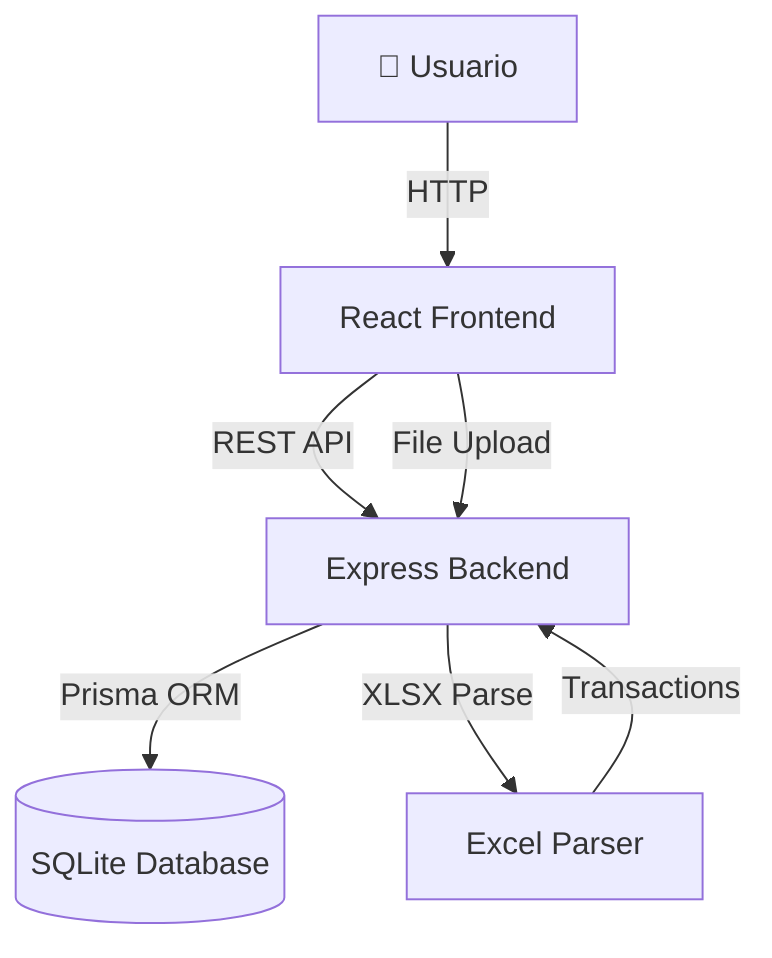

# Arquitectura del Sistema - Finanzas App

Documentación técnica de la arquitectura, decisiones de diseño y estructura del proyecto.

---

## 🏗️ System Overview



**Finanzas App** es una aplicación web full-stack diseñada con arquitectura monorepo que separa claramente la capa de presentación (frontend) de la lógica de negocio (backend).

### Flujo de Datos General

1. **Upload**: Usuario carga archivo Excel → Backend parsea → Retorna JSON
2. **Review**: Frontend mantiene transacciones en memoria → Usuario asigna items
3. **Save**: Frontend envía transacciones confirmadas → Backend guarda en BD
4. **Query**: Frontend consulta transacciones con filtros → Backend retorna datos paginados

---

## 📦 Monorepo Structure

### TurboRepo

Utiliza **TurboRepo** para gestionar el monorepo con las siguientes ventajas:

- **Build caching**: Evita rebuilds innecesarios
- **Parallel execution**: Ejecuta tareas en paralelo
- **Pipeline orchestration**: Define dependencias entre tasks

**Configuración**: `turbo.json`

```json
{
  "pipeline": {
    "build": {
      "dependsOn": ["^build"],
      "outputs": ["dist/**"]
    },
    "dev": {
      "cache": false
    }
  }
}
```

### Package Organization

```
packages/
├── frontend/        # Cliente React
│   └── src/
│       ├── components/   # UI components
│       ├── pages/        # Route pages
│       ├── hooks/        # React hooks
│       ├── stores/       # Zustand state
│       ├── lib/          # Utilities
│       └── types/        # TypeScript types
│
└── backend/         # API Express
    └── src/
        ├── controllers/  # HTTP handlers
        ├── services/     # Business logic
        ├── routes/       # API routes
        ├── middleware/   # Express middleware
        └── utils/        # Helpers
```

### Dependencies

- **Root level**: Tooling compartido (TypeScript, TurboRepo)
- **Frontend**: React ecosystem
- **Backend**: Node.js ecosystem

---

## ⚛️ Frontend Architecture

### Tech Stack

- **React 19** - UI library
- **Vite 7** - Build tool & dev server
- **TypeScript 5.9** - Type safety
- **React Router 7** - Client-side routing
- **TanStack Query** - Server state management
- **Zustand** - Client state management
- **Tailwind CSS 4** - Styling
- **shadcn/ui** - Component library

### Component Structure

Sigue principios de **Atomic Design**:

```
components/
├── ui/                # Atoms (shadcn/ui base components)
│   ├── button.tsx
│   ├── dialog.tsx
│   └── ...
├── dashboard/         # Molecules/Organisms
│   ├── TransactionsTable.tsx
│   ├── DashboardChartsRenderer.tsx
│   └── PeriodSelector.tsx
└── items/            # Feature-specific components
    ├── ItemForm.tsx
    └── CategoriesList.tsx
```

### State Management

**Server State (TanStack Query):**

- Transacciones
- Items
- Categorías
- Stats/Analytics

```typescript
const { data, isLoading } = useQuery({
  queryKey: ["transactions", filters],
  queryFn: () => apiClient.getTransactions(filters),
});
```

**Client State (Zustand):**

- Filtros de período (trimestre/año)
- UI state (modals, toasts)

```typescript
const usePeriodStore = create<PeriodStore>((set) => ({
  selectedQuarter: "ALL",
  selectedYear: new Date().getFullYear(),
  setQuarter: (quarter) => set({ selectedQuarter: quarter }),
}));
```

**Local State (React hooks):**

- Formularios (React Hook Form)
- Sesiones de carga (LocalStorage via custom hook)

### Routing

```typescript
<Routes>
  <Route path="/" element={<ExcelsPage />} />        {/* Upload & Review */}
  <Route path="/dashboard" element={<DashboardPage />} />  {/* Historical */}
  <Route path="/items" element={<ItemsPage />} />    {/* Maintenance */}
  <Route path="/analytics" element={<AnalyticsPage />} />  {/* Charts */}
  <Route path="/reports" element={<ReportsPage />} />      {/* PDF */}
</Routes>
```

### Styling Approach

- **Utility-first**: Tailwind CSS para la mayoría de estilos
- **Component variants**: `class-variance-authority` para variantes
- **Consistency**: Design tokens en `index.css`

---

## 🔧 Backend Architecture

### Tech Stack

- **Node.js 20** - Runtime
- **Express** - Web framework
- **Prisma 5** - ORM
- **SQLite** - Database
- **Zod** - Schema validation
- **Multer** - File uploads
- **XLSX** - Excel parsing

### Layered Architecture

```
Request → Router → Controller → Service → Prisma → Database
```

**1. Routes (API Endpoints)**

Define endpoints y asocia con controllers:

```typescript
router.get("/transactions", transactionController.getAll);
router.post("/transactions", transactionController.create);
```

**2. Controllers (HTTP Handlers)**

Maneja request/response HTTP:

```typescript
export const getAll = async (req: Request, res: Response) => {
  const filters = req.query;
  const result = await transactionService.getTransactions(filters);
  res.json({ success: true, data: result });
};
```

**3. Services (Business Logic)**

Lógica de negocio pura:

```typescript
export const getTransactions = async (filters: Filters) => {
  return await prisma.transaction.findMany({
    where: buildWhereClause(filters),
    include: { item: true, category: true },
  });
};
```

**4. Prisma (Data Access)**

ORM que abstrae SQL:

```typescript
const prisma = new PrismaClient();
```

### Middleware Stack

```typescript
app.use(cors()); // CORS
app.use(helmet()); // Security headers
app.use(express.json()); // Body parser
app.use(errorHandler); // Error handling
```

### Error Handling

Patrón centralizado de manejo de errores:

```typescript
// Custom error class
class AppError extends Error {
  constructor(
    public statusCode: number,
    message: string,
  ) {
    super(message);
  }
}

// Error middleware
const errorHandler = (err, req, res, next) => {
  const statusCode = err.statusCode || 500;
  res.status(statusCode).json({
    success: false,
    error: err.message,
  });
};
```

### Validation (Zod)

Schemas para validación de inputs:

```typescript
const createTransactionSchema = z.object({
  fechaValor: z.string().datetime(),
  descripcion: z.string().min(1),
  importe: z.number(),
  itemAsignadoId: z.string().optional(),
  categoryId: z.string().optional(),
});
```

---

## 🗄️ Database

### Prisma ORM

**Schema Location**: `packages/backend/prisma/schema.prisma`

### Data Models

```prisma
model Transaction {
  id              String    @id @default(uuid())
  fechaValor      DateTime
  descripcion     String
  importe         Float
  categoria       String
  itemAsignadoId  String?
  categoryId      String?

  item            Item?     @relation(fields: [itemAsignadoId], references: [id])
  category        Category? @relation(fields: [categoryId], references: [id])
  excelUpload     ExcelUpload? @relation(fields: [excelUploadId], references: [id])

  createdAt       DateTime  @default(now())
  updatedAt       DateTime  @updatedAt
}

model Item {
  id           String        @id @default(uuid())
  nombre       String        @unique
  tipo         String        // "Ingreso" | "Gasto"
  transactions Transaction[]
  categories   CategoryRel[]
}

model Category {
  id           String        @id @default(uuid())
  nombre       String        @unique
  tipo         String
  transactions Transaction[]
  items        CategoryRel[]
}

model CategoryRel {
  item       Item     @relation(fields: [itemId], references: [id])
  category   Category @relation(fields: [categoryId], references: [id])
  itemId     String
  categoryId String

  @@id([itemId, categoryId])
}

model ExcelUpload {
  id           String        @id @default(uuid())
  filename     String
  totalRows    Int
  status       String        // "processing" | "completed"
  transactions Transaction[]
  createdAt    DateTime      @default(now())
}
```

### Relations

- **Transaction ↔ Item**: Many-to-One (opcional)
- **Transaction ↔ Category**: Many-to-One (opcional)
- **Item ↔ Category**: Many-to-Many (via CategoryRel)
- **ExcelUpload ↔ Transaction**: One-to-Many

---

## 🎯 Key Design Decisions

### ¿Por qué SQLite?

**Ventajas:**

- ✅ Sin configuración de servidor de BD
- ✅ Portabilidad (archivo único)
- ✅ Suficiente para uso personal/pequeños equipos
- ✅ Excelente para desarrollo local

**Limitaciones:**

- ❌ No recomendado para alta concurrencia
- ❌ Sin replicación nativa

**Migración futura**: El schema de Prisma facilita migrar a PostgreSQL si es necesario.

### ¿Por qué Monorepo?

**Ventajas:**

- ✅ Compartir tipos TypeScript entre frontend y backend
- ✅ Builds coordinados (TurboRepo)
- ✅ Versionado sincronizado
- ✅ Refactoring cross-package más fácil

**Alternativa**: Repos separados con shared npm package para tipos.

### ¿Por qué TanStack Query?

**Ventajas sobre Redux/Context:**

- ✅ Cache automático de requests
- ✅ Revalidación inteligente
- ✅ Optimistic updates
- ✅ Menos boilerplate
- ✅ DevTools integradas

### ¿Por qué shadcn/ui?

**Ventajas sobre component libraries tradicionales:**

- ✅ Copy-paste approach (control total)
- ✅ No dependency bloat
- ✅ Customizable al 100%
- ✅ Basado en Radix UI (accesible)

---

## 🔐 Security Considerations

### Input Validation

- **Backend**: Zod schemas para todos los endpoints
- **Frontend**: React Hook Form + Zod

### File Upload Security

```typescript
// Multer config
const upload = multer({
  limits: { fileSize: 10 * 1024 * 1024 }, // 10MB
  fileFilter: (req, file, cb) => {
    const allowedTypes = [
      "application/vnd.openxmlformats-officedocument.spreadsheetml.sheet",
      "text/csv",
    ];
    if (allowedTypes.includes(file.mimetype)) {
      cb(null, true);
    } else {
      cb(new Error("Invalid file type"));
    }
  },
});
```

### CORS

Configurado para permitir solo orígenes específicos en producción:

```typescript
app.use(
  cors({
    origin: process.env.CORS_ORIGIN || "*",
    credentials: true,
  }),
);
```

### Future: Authentication

Pendiente implementar:

- JWT tokens
- Session management
- Rate limiting

---

## 📊 Performance Considerations

### Frontend

- **Code Splitting**: React.lazy() para rutas
- **Memo**: React.memo para componentes pesados
- **Virtualization**: Para listas largas (si es necesario)
- **TanStack Query caching**: Reduce requests redundantes

### Backend

- **Prisma Connection Pooling**: Por defecto
- **Indexes**: En campos frecuentemente filtrados
- **Pagination**: Implementado en queries grandes

---

## 🧪 Testing Strategy (Future)

### Frontend

- **Unit**: Vitest + React Testing Library
- **E2E**: Playwright

### Backend

- **Unit**: Vitest
- **Integration**: Supertest + test database

---

## 🔗 Referencias

- [Prisma Best Practices](https://www.prisma.io/docs/guides/performance-and-optimization)
- [TanStack Query Architecture](https://tanstack.com/query/latest/docs/react/guides/important-defaults)
- [React Architecture Patterns](https://react.dev/learn/thinking-in-react)
